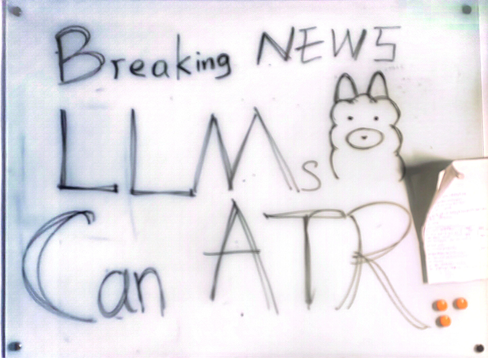

# Large Language Models Simply Achieve Explainable and Training-Free One-shot HRRP ATR :bot:
This repository provides the algorithm demonstration for C3A(-E) proposed in ICCV 2025 submission :page_with_curl: *Seeing What Few-shot Learners See: Contrastive Cross-Class Attribution for Explainability*.

 ---

> Few-shot Learning (FSL) enables deep learning models to generalize to unseen categories with minimal labeled data, making it crucial for data-constrained domains such as healthcare. However, existing FSL models lack explanability, obscuring the reasoning behind their predictions and limiting trust in their deployment. In this work, we introduce Contrastive Cross-Class Attribution (C3A) for explaining FSL, including explaining queries and episodes learning. Unlike prior explainability methods tailored to specific architectures, our approach is classifier-agnostic, focusing on the backbone network to ensure broad applicability across different FSL paradigms. Additionally, we propose a contrastive local descriptor, leveraging Naive-Bayes Nearest-Neighbor (NBNN) and Fisher score-based attribution to preserve fine-grained details and enhance inter-class discrimination. Experimental results demonstrate that C3A(-E) provides more stable and interpretable explanations compared to existing FSL explainability methods, offering deeper insights into the episodic learning process. We evaluate our methods across four FSL benchmarks, demonstrating consistent superiority over state-of-the-art methods, with absolute improvements of 19.72\% in iAUC and 25.88\% in dAAC. Its post-hoc design ensures seamless integration with diverse architectures, including Conv64F and ResNet12.
><p align="center">
  > 
</p>

 ---

## Platform :pushpin:
We wrote, ran and tested our scripts on PyCharm IDE in a Conda environment, which we recommend for reproduction.
We also recommend running the code on Linux (Our testing was done on Ubuntu 20.04).

 ---

## Dependencies :wrench:
This repository is a TensorFlow 2.5.0 implementation of C3A(-E). To install the required packages, you may simply run:
```pip install -r requirements.txt ``` if you already have a TensorFlow 2.5.0 environment.

Otherwise, you can set up the environment with the following commands:
```angular2html
conda create -n C3A python==3.6.13
conda activate C3A
pip install tensorflow-gpu==2.5.0 -i https://pypi.org/simple/
pip install opencv-python==4.3.0.38
pip install pandas
pip install slicer
pip install numba
pip install cloudpickle
pip install lime
```
 ---

## Model Weights and Data :package:
To run the scripts, you will need the query image data and model weights:

- Model weights and testing data are available for download at :link:: [Quark Drive](https://pan.quark.cn/s/d7ca67ab63e8) / [Baidu Drive](https://pan.baidu.com/s/1PW7TaLWZ5Ebs2P2Ezf2vmg?pwd=s9bc)
- Unzip the files to the base directory (i.e., ./weights/, ./data/)

 ---

## Screenshots
We argue that understanding how FSL models adapt to novel categories with minimal examples in an episode is equally crucial as interpreting queries. 
Hence, we analyze explanations from both the query sample and the episodic perspectives.

###  Feature Attribution Evaluation (Query)

Qualitative comparison of attribution maps from five XAI methods (LIME, Grad-SHAP, Grad-CAM, ProtoShot* and ours C3A)
using Conv64F backbone (Trained separately on each dataset) in 1-shot and 5-shot conditions. The query images span: Tank & French
Bulldog (miniImageNet), and Chow & Shih Tzu (Stanford Dogs), Rolls-Royce Phantom Sedan 2012 & Buick Rainier SUV 2007 (Stanford
Cars), Savannah Sparrow & Pied Kingfisher (CUB-200) (Enclosed by green dashed lines). C3A demonstrates superior spatial specificity,
with positive (Red) and negative (Blue) attributions precisely localized to class-discriminative regions (i.e. more consistent).

<p align="center">
   
</p>

### Episodic Explanation Evaluation
Comparison of episodic explanation produced by Grad-CAM, SINEX, SINEXC, ProtoShot*-E (Our Mod.) and C3A-E (Ours) of
a correct 5-way 1-shot classification on Rolls-Royce Phantom Sedan 2012 (y = l1 = 0). The rest four categories (l2, . . . , l4 = 1, . . . , 4)
are Buick Rainier SUV 2007, Ford Focus Sedan 2007, Chevrolet TrailBlazer SS 2009 and Audi S4 Sedan 2012. From the attribution
maps on the left, it can be observed that our C3A-E and ProtoShot*-E showed more fine-grained attributions. Also, the iAUC and dAAC
calculated from the curves on the right also shows our methods’ fidelity to the model’s classification results.

<p align="center">
   
</p>

 ---

## Acknowledgements :small_red_triangle:	
This project is released under :page_facing_up: the MIT license. The code is based on [ProtoNet](https://github.com/ulises-jeremias/prototypical-networks-tf) and [ProtoShotXAI](https://github.com/samuelhess/ProtoShotXAI). For comparative experiments, our repository incorporates some original code from related repositories (with modifications), which include: [SHAP](https://github.com/shap/shap), [SINEX(C)](https://github.com/andreafedele/SINEX) (Implementation of LIME and Grad-CAM were through importing packages). Please follow their respective licenses as well. We appreciate their excellent work.

## Online Demo

An interactive, client-side demonstration of the HRRPLLM prompt structure and simulated reasoning process is available:

**[➡️ Click here for the HRRPLLM Online Demo](https://YOUR_GITHUB_USERNAME.github.io/YOUR_REPOSITORY_NAME/)** 
*(Replace with your actual GitHub Pages link after deployment)*

This demo allows you to:
- View the fixed contextual information and few-shot exemplars provided to the LLM.
- Input or modify the scattering center data for a test sample.
- See a *simulated* LLM prediction and a generated rationale based on simple heuristics.

**Important:** This demo runs entirely in your browser using JavaScript. It does **not** make actual calls to any Large Language Model API. The "LLM" responses are simulated based on a simplified comparison of the input scattering centers to the predefined prototypes. It serves to illustrate the concept and the type of information an LLM would process.

### How to Run the Demo Locally
1. Clone this repository.
2. Open the `index.html` file in your web browser.